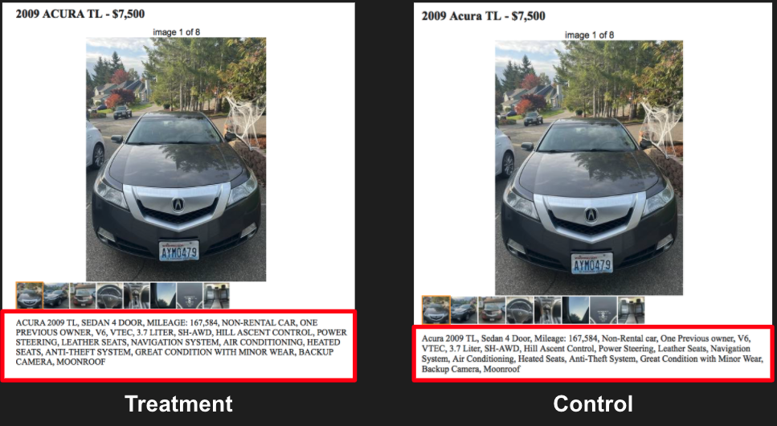
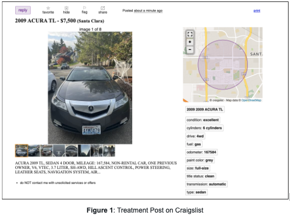
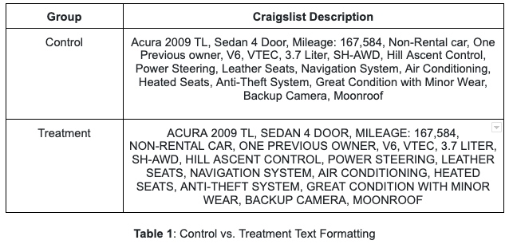
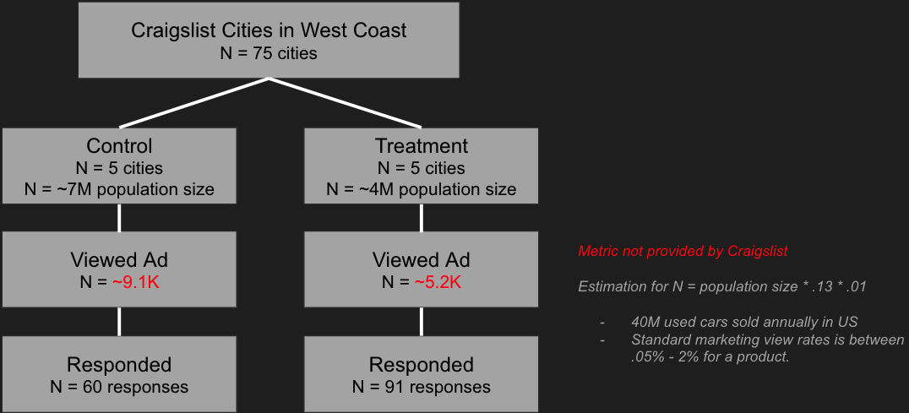
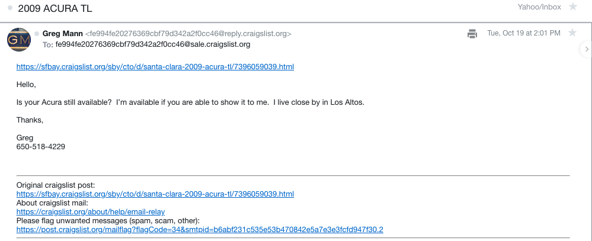
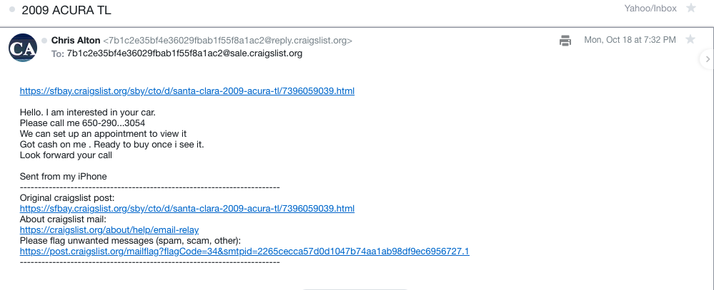
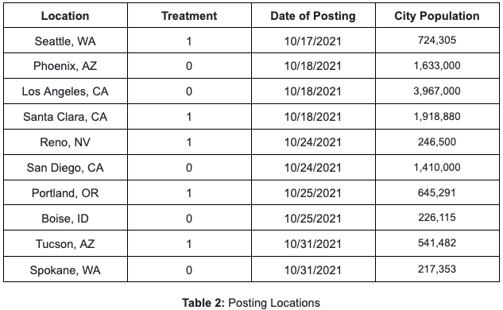

```{r setup, include=FALSE}
knitr::opts_chunk$set(echo=FALSE)
```

```{r load packages, message=FALSE, warning=FALSE}
library(data.table)
library(sandwich)
library(lmtest)
library(AER) 
library(ggplot2) 
library(patchwork)
library(stargazer)
library(broom)
library(purrr)
library(foreign)
library(magrittr)
library(knitr)
library(ggpubr)
library(reshape2)
```

# Abstract
The AD industry, both the product owners and the AD networks, are always on the lookout to get more clicks on the ADs they place in various web sites. Online ADs drive revenues of several large corporations, and is one of the chief avenues used by the products and services industry to reach their respective potential consumers. A click on an AD by an online users is revenue for the entire AD ecosystem, while, at the same time, it allows the product or services owning company gauge the level of interest, which influences the potential sale they can achieve. The AD industry is constantly varying various elements of an AD to at least get a click, if not getting the customers make a purchase.

We wanted to understand the impact the formatting of letters in an AD will have on its ability to attract attention from visitors to websites such as a marketplace or selling platforms. The approach we took was to create two ADs for a used car that only differs in the formatting of the wordings. In one of the ADs, the **Treatment AD**, all the words that describe various aspects of the car have been fully capitalized, while the **Control AD** had words the normal way - i.e only the first letter is capitalized, as in any normal writing.

The two ADs side-by-side illustrate what we advertised. This is one of the eight images we show below. All 8 images that formed the Treatment Group of ADs had the description all capitalized while those in the control group had normal lettering.



# Background
With the ever increasing options of goods one can purchase in online marketplaces, sellers need to identify more ways to capture the attention of their audience. Experimenting with fonts and colors is one method to do so — it is heavily leveraged by marketers as a means to elicit emotion, promote interest, and drive sales. This theory has already been tested on physical packaged foods. *Waheed et al*. (2018) discovered that product packaging, color, font style and overall design has a significant impact on the consumer purchase intentions.

We wanted to test this effect on the growing online marketplace platforms. Marketplace has really kicked off in recent years as a way for individuals to get rid of existing belongings. However, competition on these platforms have also skyrocketed, with buyers having an overwhelming number of goods to choose from. These platforms typically standardize fonts and limit color options. Therefore, sellers need to get creative and figure out different ways to stand out. 

We decided to focus on text formatting and understanding whether or not that played a role in one’s interest in the product. By influencing the formatting of the descriptive text, we hope to see a change in engagement and overall intent to purchase. Introducing bold or italicized text may better draw attention to specific words and capture the attention of the audience. Adding EMOJIS or symbols can also elicit emotions of the purchaser. As online sales continue to rise, we would like to identify ways to improve sales on an online platform.

We do reckon that capitalizing all the words in an AD can also have a potential negative impact. Users may find it too blaring, pushy, or otherwise cheap, and may choose to ignore the AD. 

Our aim is to study through an experiment the impact of the text formatting with the realization that treatment has as much chance to negatively impact as much as it can result in more clicks. 

# Research Question
Our primary research question is to understand if text formatting of an online car ad affects the amount of interest in the product itself. We honed in on the car resale market, because we wanted to target consumers who would actually read the ad description; since cars have steeper price points, the buyer will actually read the description in order to learn more about the mileage, make, model, feature, and condition of the car. Additionally, several details of the card can't be conveyed through pictures alone.

This experiment is also testing whether eliciting emotion may affect how a product sells. Fundamentally, humans are social, emotional creatures who yearn for connection. Experiments can be designed to test this mechanism, such as utilizing the description of a food item with either mundane (control) and exciting (treatment) adjectives in a service ad. There is a particular threshold for emotion, in that minimal amounts may not be discernible. Our experiment isn't testing a threshold, but rather a context. Will eliciting emotion specifically the description of a car ad drive greater marketability?

# Hypothesis
When looking for a large purchase, such as a car from a private seller, a buyer generally wants to purchase a car from someone who is honest and trustworthy. The potential buyer may use formatting, may be subconsciously sometime, as a way of subtly detecting the character or type of seller the person is before engaging in private conversation for the potential sale. We hypothesize that if the details section of the ad is in all caps, it could give the impression of a pushy used car salesman and deter potential buyers. 

# Experiment Design

## Experiment Overview
We conducted a clustered one-factor experiment. Our four members posted ten different ads on *Craigslist*: five control ads with standard capitalization of terms used to describe the car and five treatment ads in which these descriptive terms were all capitalized. We split the treatment and control among ten cities such that the chance of a person in one region seeing an AD other than the one we targeted is nearly zero. In addition, if we posted both control and treatment ad in each location one of the ADs would have been flagged as duplicate, which might render both ads as fraudulent. Thus, each location was exclusively either in treatment or in control.

As a potential outcome for comparison, we were interested in the number and rate of responses for each ad. Unfortunately, we were unable to track the number of visitors for each ad in order to discern response success rates. Instead, we will look at the number of responses received during the first three weeks of the post date for each ad. From these responses, we created an “interest-scoring” system that will provide further analysis for our regression. Each click generated an email to us which we then parsed to quantify the interest viewers expressed in the AD. This is described in some more in the section **Data Collection and Measurements**.

Each post will have the same picture, content, and information. See Figure 1 for a sample post. 


## Treatment and Control
Treatment and control both received identical information, content, and photos. However, what differed was the text formatting. The treatment received text in all uppercase capitalization but the control received standard English capitalization. 

Each ad featured an Acura 2009 TL car with eight pictures encompassing different internal and external views. The description contains basic and necessary logistical and technical information about the vehicle. To determine the price for this used Acura 2009, we looked at other posts with the same model & make and similar mileage and took the average price of these posts. For the description, we tried to mimic example ads from Autotrader.



## Data collection and Measurements
The data flow is captured in the picture below:


We posed the ad to *Craigslist* starting from Oct. 17th, 2021. Our measurement was done with email responses from those who clicked. We each had our private email listed as the contact email for each of our AD placement. When users clicked on the AD for a specific region we received an email, and we immediately started populating a row for each such response. 

When email responses were received we transferred details such as the date and time when the response were received, the unique user name (assigned by *Craigslist*), the actual user-name, and we also parsed for various interest levels. The information we gather from the email is explained in the table below:

|**Interest Criteria**| **Description**|
|  -----------------  |  :-----------:|
|*Contact Provided*   | Provided contact information - phone number, name, email|
|*Ready to buy*       | Clearly express a desire to buy than just exploratory|
|*Want now*           | Expresses a sense of urgency to buy the car|
|*Ready to pay*.      | Makes an offer or indicates they have funds to buy|
|*Set appointment*    | Offers to meet to examine the car and/or close the deal|
|*High interest*      | Clicked the AD more than once; multiple queries|

|**Table of Interest Criteria**|
| :--------------------------:|

Each of the "Interest Criteria" got a 1 if the email from the user supported that criteria. Otherwise the criteria got a score of 0. Some of the email scored on multiple criteria. For instance, one of the emails had the respondent's cell phone number, and the respondent wanted to set an appointment to see the car. We also created a composite "interest_final" column in the data that carried the sum of these individual criteria. The Google sheet was formatted to be able to compute these sums automatically. We also added a routine to convert the date and time of the email response to the corresponding "date-time" value which carried the number of seconds elapsed from Jan. 1st, 1970 mid-night.

The email below has interest_final value of 3. The person clicked, provided contact, and wanted an appointment.



This email has interest_final value of 5. The person clicked the AD, ready to pay (cash), set appointment, want to buy now, and provided contact.



In addition, we added the median household income, population, and distance from Seattle (where the car is registered) as additional columns. The idea was to use these additional parameters to see if the population density or proportional income gave additional insights.

## Randomization
We identified ten metropolitan cities on the West Coast to post our ads in. We decided on a clustering randomization approach to avoid potential spillover. By posting both the treatment and control in the same city, we run the risk of having an individual see both ads and question its legitimacy. The ad likely could have been flagged by the *Craigslist* platform as duplicate posts within the same city. Therefore, our design ensured everyone within the same city was assigned to the same group. 

One potential caveat is that different cities may have different utilization of *Craigslist*. Therefore, we decided to limit this experiment to the more populous cities on the West Coast that all have relatively high activity on *Craigslist*. We also selected cities that have relatively similar rates of driving. For example, we decided to post in Santa Clara instead of San Francisco, because those living in SF have access to good public transportation and high parking prices. 

In retrospect, it would have been best to ensure that the total population for the treatment (4M) and control (7M) were relatively similar in size. It would have been a more rigorous randomization method for a pairing of treatment and control to be selected with a similar population.  However, we will account for these population differences through normalization in our analysis. 



## Observations and Outcomes
```{r load draft data, warning=FALSE}
setwd('/home/rstudio/kumarn/MIDS/w241/w241-final-project')
d <- fread('./ad_response.csv')
robust_se <- function(mod, type = 'HC3') { 
  sqrt(diag(vcovHC(mod, type)))
}

cluster_se <- function(mod) {
  coef(summary(mod, cluster=c("cluster_id")))[, 2]
}
```

The data we collected breaks by location as indicated by the following figure. 

```{r distribution by city}
colors <- c()
for (city in unique(d$geography)) {
  t <- unique(d[geography == city, treatment])
  if (t == 0) {
    colors = c(colors, "gray50")
  }
  if (t == 1) {
    colors = c(colors, "gray70")
  }
}

tmp <- boxplot(interest_final~geography, 
               data=d,
               main='Response from each city',
               xaxt='n',
               xlab='',
               ylab='Level of reponse',
               col=colors
               )
axis(1, labels=FALSE)
text(x =  seq_along(tmp$names), y = par("usr")[3]-0.5, srt = 45, adj = 1,
     labels = tmp$names, xpd = TRUE)

legend("topleft", inset=.05, title="Treatment or Control",
   c("Control", "Treatment"), fill=c("gray50", "gray70"), horiz=TRUE, cex=0.8)
```
Note that Boise is under the "Control" group. We don't see Boise's state clearly because there was only 1 response from Boise. 

We also show the consolidated data broken by treatment and control.

```{r treatment Vs control response}
d_treat_ctrl <- d[ , .(counts=.N), by=treatment]

ggplot(d_treat_ctrl , aes(x = treatment, y =counts, 
                          fill=factor(ifelse(treatment==1, "Treatment", 
                                             "Control")))) +
  geom_bar(stat = "identity") +
  scale_fill_manual(name="treatment", values=c("gray50", "gray70")) +
  scale_x_discrete(labels=c("0", "1")) + 
  labs(title='Treatment Vs Control counts', x = "Treatment-Control split")
```
Our outcome measure was the number of responses received for each *Craigslist* post and a point-based interest scale with the following criteria displayed in the table "*Table of Interest Criteria*", in the section **Data collection and Measurements**.  We will sum the value of each criteria to calculate an integer point value greater than 0.

We observed several instances of multiple entries from buyers across almost all locations. For example, a user named “Robert Storseth” of Spokane replied four times from 10/31/2021 to 11/03/2021 with the response ‘6000 cash?’. To account for multiple entries, each email they sent will be calculated as a point for the number of messages sent. In this case, Robert received 4 points from this category. If the messages change for each subsequent email, we will only concern the criteria met in the very first message sent.

We also noticed that the ad response decayed with time quite precipitously. The 1st few days saw the most response, after which the responses went down to low single digits, and to zero or one soon after that. Older ads may likely either convey to a buyer that the information is outdated, in which an item has already been sold, or it could be fake, in which an ad has been and/or is misleading. In addition, *Craigslist’s* posting algorithm also biases towards new posts; they display ads in the order that it was posted from most recent to least. 

We captured the response as a function of time as below:

```{r ad response as a function of time for each city}
dt_freq <- d[ , .(counts=.N), by=list(geography, date)]
ggplot(dt_freq, aes(date, counts)) +
  geom_line(aes(group=geography)) + 
  geom_point(aes(shape=geography)) + 
  scale_shape_manual(values=c(1:10)) + 
  scale_x_discrete(guide=guide_axis(angle=45)) +
  labs(title="AD response as a function of date")
```
A potential issue that was uncovered during our unveiling of treatment and control was that several images of the car included a Washington state license plate. This could be a bias that potentially affected buyers' outlook of the sale as fraudulent such as those from cities outside Washington, such as Arizona or Nevada. This certainly may have affected the number of responses that these cities received. Our counteraction of this was choosing and alternating treatments for pairs of cities in close proximity to each other such as Tucson/Phoenix or Seattle/Spokane.

# Results
With the analysis from 151 responses we gathered we wanted to answer if our hypothesis that all-capitalization impacts the response to a used-car online ad. While we just wanted to observed the response we were of the opinion that all-capitalization may turn users away from the ad, and that the control ad (the ones with normal level of capitalization) will attract more statistically significant response. Numerically, we received more response from locations that were part of the treatment group, even though the population size of the control group was approximately 7.4M, while that of the treatment group was 4M.

```{r response count}
d_treat_ctrl <- d[ , .(counts=.N), by=treatment]

ggplot(d_treat_ctrl , aes(x = treatment, y =counts, 
                          fill=factor(ifelse(treatment==1, "Treatment", 
                                             "Control")))) +
  geom_bar(stat = "identity") +
  scale_fill_manual(name="treatment", values=c("gray50", "gray70")) +
  scale_x_discrete(labels=c("0", "1")) + 
  labs(title='Treatment Vs Control counts', x = "Treatment-Control split")
```
This begged the question if treatment had any effect on the number of responses. A simple regression of the response count as a function of the treatment (see sub-section **Regression of response by treatment** under the **Regression** section) showed that the treatment had no statistically significant effect.

We then shifted attention to the "interest_final" variable. This variable captured the interest level of a person who clicked the ad. Based on the email response we assigned a 0 or 1 to various interest levels as explained in the sections **Data collection and Measurements** and in the section **Observations and Outcomes**. 

We conducted a t-test of the "interest_final" split by treatment and control. The t-test came out to show that the Null Hypothesis holds good - i.e the interest_final score distribution isn't affected by the treatment assignment. The subsequent regression yielded a result consistent with the t-test. These are described under sub-section **Does interest level respond to treatment?** in the **Regressions** section.

We suspected if the vehicle being registered in Seattle, WA had any impact on the response in Seattle and in other cities. When online users buy a car from an unknown individual it's reasonable to suspect if the local registration mattered or not. We found that in the type of resposne and in the regressions the license plate being that of Seattle, WA and the distance from Seattle didn't matter.

With added information of the population density and mean income for each location we conducted a series of regressions adding one covariate at a time. See sub-section **Add more covariates** in the **Regressions** section. We observed that in the model that regressed interest_final against "treatment", "population_density", "distance", and "mean income" we found that the income was the only variable that had a statistically significant effect. Every $1000 increase in income contributes approximately 0.04 to the interest_final outcome.

We then plotted the mean interest_final level against mean_income level.

```{r income Vs interest level}
mean_inc <- c()
mean_int <- c()
cities <- sort(unique(d$geography))
for (city in cities) {
  mean_inc <- c(mean_inc, d[geography==city, mean(income)])
  mean_int <- c(mean_int, d[geography==city, 
                            as.character(round(mean(interest_final), digits=4))
                           ])
}
df <- data.frame(
  location = cities,
  mean_income = mean_inc,
  mean_interest = mean_int
)

df <- df[order(df$mean_income),]

df$mean_income <- as.character(df$mean_income)
df$mean_income <- factor(df$mean_income, levels=df$mean_income)

p1 <- ggplot(df, aes(x=mean_income, y=mean_interest)) + 
  geom_bar(stat="identity") + 
  coord_flip() + 
  geom_text(aes(label=location), vjust=0) +
  labs(x = "Mean income", y = "Mean interest level in AD", 
       title = "Mean interest level in AD Vs Mean income by location")
p1
```

While the graph isn't monotonically showing higher interest level as a function of Mean Income it appears that the income has an overall impact on the response to the ad. Perhaps it's the combination of income and population density. However, we don't have results that substantiates such a conclusion.

# Regressions

### Regression of response by treatment
Let's first compare the number of responses from each of the locations (10 locations in total) based on the treatment or control the location was assigned to. 

```{r test the number of response based on treatment, warning=FALSE}
df_count <- d[ , .(counts=.N), by=list(geography, treatment)]
model_resp <- lm(counts ~ treatment, data=df_count)
stargazer(model_resp, model_resp, type='text', se = list(robust_se(model_resp),
                                                        cluster_se(model_resp)))
```
While the treatment shows a positive coefficient we don't see the effect of treatment as statistically significant. Neither Robust Standard Error (1) nor Cluster Standard Error (2) changes the outcome. Note that negative adjusted R2. This implies insignificance of the the explanatory variable. Likely a large sample size (many more locations) might help.

### Does interest level respond to treatment?
The "interest_final" variable captures the sum of the scores of various interest levels. (See section **Data collection and Measurements** for explanation). We now examine if the variable "interest_final" records any treatment effect using both t-test and a linear regression.

```{r t-test of the treatment Vs control}
t.test(d[treatment == 1, interest_final], d[treatment == 0, interest_final])
```

```{r linear regression analysis - base model, warning=FALSE}
model_1 <- lm(interest_final ~ treatment, data=d)
stargazer(model_1, type='text', se = list(robust_se(model_1)))
```
Clearly, both the t-test and the linear regression show no treatment effect that is statistically significant.

### Add more covariates
```{r add population density, warning=FALSE}
cities <- sort(unique(d$geography))
pop_density <- c(2749, 7009, 3126, 4740, 2451, 4381, 7293, 9260, 3310, 2330)
for (i in c(1:10)) {
  d[geography == cities[i], population_density := pop_density[i]]
}

model_21 <- lm(interest_final ~ treatment + distance, data = d)
model_22 <- lm(interest_final ~ treatment + population_density + distance, 
               data = d)
model_23 <- lm(interest_final ~ treatment + population_density + distance + 
                 income, data = d)
stargazer(model_21, model_22, model_23, type='text', 
          se = list(robust_se(model_21), robust_se(model_22), 
                    robust_se(model_23)))
```
The output above shows that in all cases treatment effect is statistically insignificant. Distance from Seattle (where the car is registered) also didn't matter. Model (1) carried all its weights in the Constant. Model (2) pushed part of weight from constant into population density. Model(2) claims that every additional 100 people per square mile add 0.02 to the final interest outcome. Model (3) shows that the only variable that matters is the median income of the location. Every $1000 increase in income contributes approximately 0.04 to the interest_final outcome.

# Conclusions
The study set out to find the effect of capitalizing wordings on an online ad for a used-car. Our assumption, when we started, was that all-capitalization will impact clicks on our ads, likely negatively. Our experiment didn't find any causality between the word formatting and the response level to the ad. 

As we considered additional factors that might influence people desire to buy a used car we found that mean income may have a role to play. Other factors such as where the vehicle is registered and the population density of the location had no statistically significant role to play, in the final analysis.

We could potentially start looking at the effect on each of the individual "Interest Criteria" due to treatment effect and see if we find at least one such criteria showing a treatment effect. That would tantamount to the classic fishing expedition, where it would appear to show us desperate to somehow get a result. Clearly, we want to avoid this case.

As described in the next section a more robust A/B test framework may be the right framework to study the impact of variation in ads.

# Limitations and Future Enhancements
One of the biggest limitations to this experiment is that *Craigslist* does not provide additional metrics on the number of views and reach per post. Therefore, we are basing this entire experiment on the number of responses received. If we had additional information, we would be able to calculate a more accurate response rate for the treatment and control. In addition, we do not have any demographic information about the individuals who responded to our ad. 

We also wanted to see the effects of text formatting on different online marketplaces. However, we faced several platform limitations for some of these sites. One option was to create a post on Facebook Marketplace and then turn the post into an ad by boosting it when publishing. We will create two posts (one treatment and one control). We are concerned that FB will flag duplicate posts, which is why we are only limiting it to two posts by two accounts in separate locations. Unfortunately, we are not able to use FB’s built-in A/B testing functionality because it requires a business account, company registration, and a company page to do so. We are concerned that having a bare-bones page (with no photos or history of posts) would be suspicious and deter users from reaching out about the post. In addition, we did not want the personal information of the fake Facebook profile to detract from the content of the ad. Therefore, we opted to forgo this option. *Autotrader* was another marketplace we originally considered. However, the site has a steep fee for each post and requires proper documentation, like VIN numbers and license plate number, for each car in order to authenticate the ad. Given that we were not actually planning on selling multiple used cars, we were unable to pull this information together. In addition, this would limit the number of ads we were able to pull. Ultimately, we choose to use *Craigslist*, because posting on the platform itself introduces the least amount of confounding variables. *Craigslist* also does not flag duplicate posts with the same content and photos, which allows us to post in more cities around the same time without any issues. Given more time, we would ideally post on more platforms.

We would also like to call out the current used-car shortage happening within the United States. If we had the data, we could have done a deeper dive analysis into understanding the cities with a relatively similar shortage rate and target those locations. 

One interesting future enhancement that we did not have the opportunity to conduct is advertising cars of varying price points and brands. We could have even simplified this experiment and did a 2x2 factorial design with text formatting (normal caps or all caps) and price points (high or low).  However, we did not have used cars or photos and consequently, could not have published fake ads for. However, if we did have time to collect this information, we could have offered a $100 gift card to those willing to share pictures of their vehicle to us and be part of this study. 


